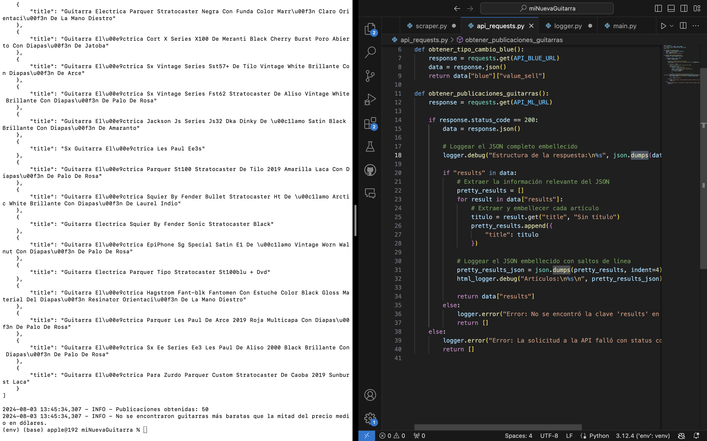

# Comparador de Precios de Guitarras Eléctricas

Este proyecto tiene como objetivo comparar los precios de guitarras eléctricas entre Mercado Libre y Amazon, utilizando sus respectivas APIs. El objetivo es encontrar las mejores ofertas y devolver los enlaces a los productos más económicos basandonos en la teoria de que los precios en argentina son el doble de caros que es eeuu, de esa manera devuelve enlaces a productos del mismo tipo que sean mas baratos que lo que indica esa regla

## Descripción del Proyecto

El proyecto realiza las siguientes tareas:
1. Obtiene los precios de guitarras eléctricas en Mercado Libre.
2. Obtiene los precios de guitarras eléctricas en Amazon.
3. Convierte los precios de Mercado Libre a dólares utilizando el tipo de cambio "blue".
4. Compara los precios de guitarras similares entre ambos sitios.
5. Devuelve una lista de las guitarras más económicas con enlaces a los productos en Mercado Libre si son más baratos que en Amazon.

## Estructura del Proyecto

El proyecto está dividido en varios archivos para mantener la organización y seguir buenas prácticas de programación.

### Archivos

- **main.py**: Archivo principal que coordina la ejecución del proyecto, llamando a las funciones de obtención de datos y comparación de precios.

- **api_requests.py**: Contiene las funciones para obtener los datos de guitarras eléctricas desde Mercado Libre y Amazon ademas del obtener el tipo de cambio "blue".

- **scraper.py**: Contiene la función para comparar los precios entre Mercado Libre y Amazon y devolver los enlaces a las mejores ofertas.

- **logger.py**: Configuración y manejo de logging para guardar logs del proceso de scraping y comparaciones.

- **settings**: Tiene los URl's a los cuales quiero acceder.

## Configuración y Uso

### Requisitos

- Python 3.7 o superior
- Biblioteca `requests` para realizar solicitudes HTTP
- Biblioteca `BeautifulSoup` para parsear HTML (si se usa scraping para Mercado Libre)
- Biblioteca `boto3` para acceder a la Amazon Product Advertising API

### Instalación

1. Clonar el repositorio:
   ```bash
   git clone https://github.com/tu_usuario/ComparadorPreciosMLContraAMZ.git
   cd ComparadorPreciosMLContraAMZ


